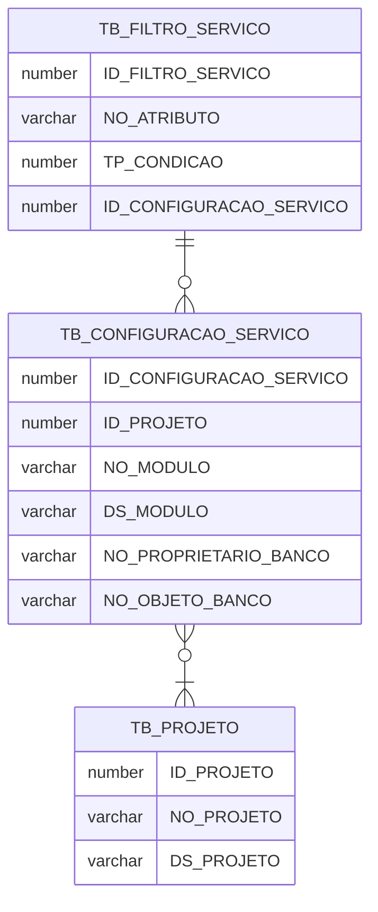

# Projeto Rebeca

O Nome  **Rebeca**  significa "união", "ligação", "aquela que une" ou "mulher com uma beleza que cativa (ou prende) os homens". O nome Rebeca vem do hebraico Ribhqah, que literalmente significa "união", "ligação", "aquela que une". O objetivo deste projeto é apresentar os dados de qualquer tabela de um banco de dados Oracle em Json e disponibilizados em formato REST.

  Exemplo da recuperação e uso ( utilizando JupiterLab) de dados via API REST.

## Linguagens, frameworks ou outras tecnologias e serviços

Rebeca utilizou para o back-end a linguagem de programação Java juntamente com o framework Spring Boot. Esse framework oferece diversos módulos que podem ser utilizados de acordo com as necessidades do projeto, como módulos voltados para desenvolvimento Web, persistência, acesso remoto e programação orientada a aspectos. 

Inicialmente Rebeca utiliza o banco de dados Oracle para recuperar os metadados de um sistema e transformar os dados em Json, sendo recuperado pela camada de back-end e a partir das configurações definidas pelo administrador, disponibiliza em um terminal(endpoint) gerado em tempo de execução.

Para camada de apresentação foi utilizado o Angular que é uma plataforma de aplicações web de código-fonte aberto e front-end baseado em Typescript. Para a execução do ambiente através do Docker é utilizado o servidor web Nginx.

## Requisitos para produção

-   Oracle com mínimo a versão 12c.
-   Ambiente que satisfaça os requisitos para  [implementação de um aplicativo utilizando SpringBoot](https://docs.spring.io/spring-boot/docs/current/reference/html/deployment.html).
- Ambiente que satisfaça os requisitos para [implementação de um component utilizando Angular(https://angular.io/guide/deployment)

## Requisitos para ambiente de desenvolvimento

Para poder construir o aplicativo, empacotá-lo junto com suas dependências em um contêiner e, em seguida poder enviar para ser executado em outras máquinas foi utilizado o Docker, que é uma plataforma de contêiner de software.  

## Docker

Todo o ambiente foi dockerizado portanto basta subir todos os serviços basta executar o comando:

```
docker-compose up --force-recreate --build
```

## Serviços disponíveis

### Front-end

- Acesso : http://172.19.0.4/

### #Back-end


-   Swagger: http://172.19.0.2:8081/swagger-ui.html#/
-   EndPoints: -  **Confiurações**: Configuração que indicará quais tabelas/views/materialized views terão seus dados disponibilizados. Também será informado quais filtros serão obrigatórios e aplicados em cada consulta. -  **Conjuto de dados**: Apresenta o dado de um objeto que foi configurado para ser apresentado. -  **Filtros**: Filtros que serão aplicados nos datasets. Um filtro sempre necessita dos critérios que serão aplicados. Ex: Em um data set que apresenta os Estados brasileiros pode existir um filtro com a Unidade Federativa, portanto essa UF deverá ser informada no endpoint -  **Projetos:**  Mantêm os projetos que terão os dados disponibilizados -  **Endpoint:**  Relação das interfaces disponíveis para uso

## Operacionalização

Existe dois meios de operacionalizar o sistema Rebeca, via [back-end](#operacionalização-via-back-end) aonde através dos endpoints ou até do swagger podemos cadastrar projetos, criar configurações e apresentar os datasets, porém é recomendado a utilização do [front-end](), pois além da fácil utilização do sistema por uma camada web mais intuitiva, existem algumas validações tanto dos conteúdos que são enviados quanto dos que são recebidos, além de outras funcionalidades não implementadas no back-end. 

Porém existe um fluxo que é necessário independente da via que está sendo utilizanda que é a criação do objeto que vai representar o dataset que será apresentado para ser consumido. 

### Preparação do dataset
Rebeca monitora qualquer view criada em seu schema portanto para que um dataset seja apresentado é necessário a criação de uma view apontando para qualquer outro objeto de banco de dados no servidor ou se necessário acessar de outro servidor recomenda a utilização de um dblink. 


Para efeitos de teste podemos criar a seguinte view utilizando o banco de dados de exemplo (schema CO) que está sendo criado via migrate do banco de dados.

Executar em um client do banco de dados 
```
CREATE OR REPLACE VIEW "REBECA"."CUSTOMER_ORDER_PRODUCTS" AS 
  select o.order_id, o.order_datetime, o.order_status,
         c.customer_id, c.email_address, c.full_name,
         sum ( oi.quantity * oi.unit_price ) order_total,
         listagg (
           p.product_name, ', '
         ) within group ( order by oi.line_item_id ) items
  from   CO.orders o
  join   CO.order_items oi
  on     o.order_id = oi.order_id
  join   CO.customers c
  on     o.customer_id = c.customer_id
  join   CO.products p
  on     oi.product_id = p.product_id
  group  by o.order_id, o.order_datetime, o.order_status,
         c.customer_id, c.email_address, c.full_name;

```
Estava view também existe no schema CO, apenas replicaremos o seu código. 

## Dados

### Banco de dados

Acessos ao SGBD e aos seus serviços de gerenciamento e monitoramento:

-   SGBD: Oracle Standard Edition 12c Release 2



#### Entidades

##### TB_PROJETO

Projeto que disponibilizará dados em formato Rest para o Rebeca. |Campo | Descrição | | --- | --- | | ID_PROJETO | Identificador gerado automaticamente pelo Oracle. Auxilia na identificação da configuração do serviço REST. | | NO_PROJETO | Nome único do projeto que irá disponibilizar dados para o Rebeca | | DS_PROJETO | Breve descrição do projeto. |

----------

##### TB_CONFIGURACAO_SERVICO

A Representational State Transfer (REST), em português Transferência de Estado Representacional, é uma abstração da arquitetura da World Wide Web, mais precisamente, é um estilo arquitetural que consiste de um conjunto coordenado de restrições arquiteturais aplicadas a componentes, conectores e elementos de dados dentro de um sistema de hipermídia distribuído. O REST ignora os detalhes da implementação de componente e a sintaxe de protocolo com o objetivo de focar nos papéis dos componentes, nas restrições sobre sua interação com outros componentes e na sua interpretação de elementos de dados significantes.Esta entidade irá auxiliar na configuração do serviço rest e a camada de acesso aos dados, fazendo com que o serviço seja acessado dinamicamente tendo como base a configuração definida pela administração de dados. | | Campo | Descrição | | --- | --- | | ID_CONFIGURACAO_SERVICO | Identificador gerado automaticamente pelo Oracle. Auxilia na identificação da configuração do serviço REST.| | ID_PROJETO | Código do projeto | | NO_MODULO | Nome do módulo que será passada pela URI do serviço REST (URI - Identificador de Recursos Universal, como diz o próprio nome, é o identificador do recurso. Pode ser uma imagem, uma página, etc, pois tudo o que está disponível na internet precisa de um identificador único para que não seja confundido. | | DS_MODULO | Breve descrição do módulo que está sendo acessado. | | NO_OBJETO_BANCO | Nome físico do objeto dentro do banco de dados. | | NO_PROPRIETARIO_BANCO | Nome do owner do objeto dentro do banco de dados |

----------

##### TB_FILTRO_SERVICO

Cada configuração poderá utilizar mais de uma condição de filtro juntamente com um objeto

Campo | Descrição | | --- | --- | ID_FILTRO_SERVICO | Identificador gerado automaticamente pelo Oracle. Identificador que auxilia na identificação de um filtro que poderá ser utilizado dentro de uma configuração do serviço REST| | NO_ATRIBUTO | Nome do atributo que será utilizado como filtro | TP_CONDICAO | Tipo de operacao que podera ser aplicada em um campo especifico do objeto. Valores possiveis: IGUAL(0, "= :1"), DIFERENTE(1, "!= :1"), MAIOR(2, "> :1"),MENOR(3, "< :1"), MAIOROUIGUAL(4, ">= :1"), MENOROUIGUAL(5, "<= :1"), IN(6, "( select * from (TABLE(REBECA.fnc_string_virgula_tabela(:1))))"); Obs: Para operaćões utilizando IN, será utilizado uma funćão que irá quebrar as strings passadas no final do endpoint e transforma-las em uma colećão interável do Oracle. Ex; http://localhost:8080/data-set/all/PROJETO/MODULO/6/35228266,35274100,35442987 <<- Aonde o número 6 é o filtro criado para esse atributo | | ID_CONFIGURACAO_SERVICO | Auxilia na identificação da configuração do serviço REST. |

----------

##### VW_END_POINT

End points da API gerados a partir das configurações feitas para o projeto. Obs: quando o end point possui um filtro específico ele irá ser apresentado envolto com chaves ({}), porém ao ser usado na API deverá ser informado somente o valor que deseja filtrar. Ex: filtro com ID de número 1 e condição definida como CAMPO = :1 / Como deverá ser passado no endpoint /1/VALORDOCAMPO |

| Campo | Descrição | | --- | --- | | ID | Identificador gerado automaticamente somente para referência da linha | | END_POINT | Exemplo de como está sedo gerado um endpoint para disponibilização de dados. Se baseia na união de várias informações das outras tabelas | | ATRIBUTO_FILTRO | Caso um endpoint possua um filtro em um campo específico, será apresentado a regra correspondente para o símbolo "?" apresentado no campo END_POINT. | | NO_PROJETO | Nome do projeto que está disponibilizando os dados. | | NO_MODULO | Nome do módulo deste sistema.| | DS_MODULO | Breve descrição do módulo de um sistema. | ##### VW_TIPO_FILTRO Visão que auxilia na conversão do enumerador que combina o operador de comparação (=, <, >, <=, >=, !=, IN)

| Campo | Descrição | | --- | --- | | ID | Identificador gerado automaticamente somente para referência da linha | | END_POINT | Exemplo de como está sedo gerado um endpoint para disponibilização de dados. Se baseia na união de várias informações das outras tabelas |

### Scripts da estrutura inicial

Dentro da pasta /src/main/resources estão todos os scripts .sql utilizados no projeto. Está incluso a criação do usuário REBECA e seus objetos (tabelas, views, funções, procedures e permissões ). Foi incluso também um schema (CO), que contém algumas tabelas e views para serem utilizadas para demonstração já que possui alguns dados interessantes para serem manipualdos.


## Dados de conexão para os serviços inclusos no Docker-compose

### Conexão para os usuários sys e system

```
- Hostname: 172.19.0.3
- Porta: 1521
- Sid: xe
- Password: oracle
```

### Conexão com gerenciador Oracle Application Express web

```
- http://172.19.0.3:8080/apex
- workspace: INTERNAL
- user: ADMIN
- password: 0Racle$
```

### Conexão com o console do Oracle Enterprise Manager

```
- http://172.19.0.3:8080/em
- user: sys
- password: oracle
- connect as sysdba: true
```

## Operacionalização via front-end

### Criar projeto
Após a criação de uma view que irá apontar para qualquer objeto de banco de dados basta clicar no botão "+ PROJETO" para criar o primeiro projeto. 


Com isso será apresentado uma janela para preenchimento dos dados do projeto, como seu nome, uma breve descrição e uma URL externa que pode ser utilizada para encaminhar para uma outra página detalhando mais o projeto.  


Após preencher todos os dados, clicar no botão "CADASTRAR PROJETO"

Se tudo estiver correto será apresentado uma mensagem de sucesso. 


Primeiro projeto criado. 


### Lista de projetos

Cada card do projeto possui outras ações que podem ser realizadas.

1. Delete: Só é possível deletar o projeto caso não exista nenhuma configuração para este projeto, caso contrário este botão estará desabilitado

2. Editar: Ação para editar os dados do projeto.

Após a alteração dos dados, clicar no botão "ATUALIZAR PROJETO"


3. Link Externo: Possibilitar abrir uma nova janela no navegador para apresentar uma outra página referente ao projeto. 

4. Manter configurações


Esta tela possibilita criar as configurações para cada dataset que será apresentado no projeto. 

- Informar os dados básicos da configuração. 
-- Cada configuração é tratada como um módulo dentro do projeto , portanto o primeiro formulário é referente a informação do módulo. O nome do módulo será utilizado para construir a URL para acesso ao dataset. Ex: http://rebeca/projetoinicial/primeiromodulo
-- O campo "Objeto" aprensenta as views(datasets) previamente criadas dentro do banco de dados no schema Rebeca.

Após informar todos os dados do módulo clicar no botão "PRÓXIMO"


- Definir os filtros
-- Os filtros serão considerados como subdatasets aonde poderá restringir o retorno somente de um valor contido em um dos atributos do objeto. Seria algo como um "select * from objeto where atributo = '?". Recomenda-se escolher somente dados categóricos pra seja de fácil utilização, porém nada impede de escolher outros tipos de atributos.


Este passo não é obrigatório, caso não seja escolhido nenhum atributo, o módulo terá somente a visualização total do dataset. Para prosseguir clicar no "PRÓXIMO".

- Concluir cadastro
-- Após o preenchimento de todos formulário finalizar clicando no botão "CRIAR CONFIGURACAO"


Será apresentado uma mensagem informando que a configuração do módulo foi efetuada com sucesso. 


Após esste cadastro será possível visualizar a configuração cadastrada, podendo também excluí-la ou edita-la. 


5. Apresentação dos datasets

Esta tela apresenta todas as configurações(módulos) cadastradas para um projeto. Será apresentado na lsita tanto um dataset completo quanto um para cada atributo selecionado no cadastro. 


Clicando em um módulo poderá ser visto mais detalhes e algumas ações.

1. Nome do módulo
2. Descrição do módulo
3. Informação se a configuração está ou não utilizando algum atributo como filtro
4. Request URL: É o link final para acessar o dataset via Rest
5. Curl: Caso queira acessar o dataset via linha de comando
6. CSV: O dataset também poderá ser baixado via arquivo .CSV. Este aquivo só póderá ser baixado em datasets completos
7. Referência acadêmica: Clicando no botão ao lado um texto para ser utilizado em estudos será copiado para a área de trasnferência. 


## Operacionalização via back-end


Existe um fluxo que deve ser seguido para que os dados possam ser apresentados de forma correta. Abaixo está o diagrama de sequência que auxilia no entendimento deste fluxo:  `` ` ``  sequenceDiagram

Administrador->>+Rebeca: Cadastra projeto

Administrador->>+Rebeca: Cadastra a configuração de um projeto

Administrador-->+Rebeca: Cadastra filtros para uma configuração

Usuário-->+Rebeca: Lista endpoints disponíveis

Usuário->>+Rebeca: Consulta dados  `` ` ``

----------

Após o sistema e banco de dados disponíveis, para o cadastro de exemplos basta chamar os comandos abaixo. Lembrando que existe o schema com dados disponíveis para teste (CO) que se encontra já carregados no banco Oracle do ambiente de desenvolvimento, porém para saber toda estrutura deste schema será necessário acessá-lo diretamente no banco para visualizar sua estrutura.

### Cadastrar projeto


### Listar projetos


----------

### Cadastrar configuração


### listar configurações (Sem filtros)


----------

### Cadastrar filtro


### listar configurações (Com filtros)


----------

### Listar EndPoints


----------

Um dataset pode ser acessado de duas formas:

-   A primeira forma não utiliza nenhum filtro, portanto será apresentado toda os dados desse objeto que foi mapeado na configuração. - http://localhost:8081/dataset/TESTE/ENTREGA  
-   A segunda forma, utilizando o filtro cadastrado (SHIPMENT_STATUS = ?), ao passar uma das classes possívels (DELIVERED, SHIPPED) será apresentado os dados filtrados por esse campo. - http://localhost:8081/dataset/TESTE/ENTREGA/1/DELIVERED  

## To-Do

-   Segurança
-   Por para outros bancos relacionais e nosql