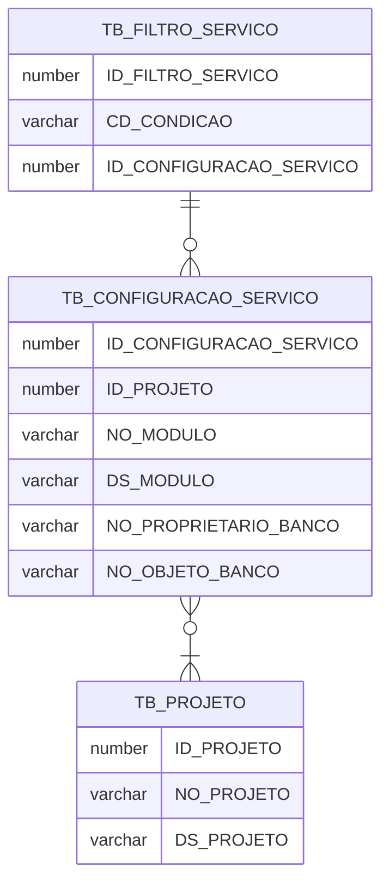

# Projeto Rebeca

O Nome **Rebeca** significa "união", "ligação", "aquela que une" ou "mulher com uma beleza que cativa (ou prende) os homens". O nome Rebeca vem do hebraico Ribhqah, que literalmente significa "união", "ligação", "aquela que une".
O objetivo deste projeto é apresentar os dados de qualquer tabela de um banco de dados Oracle em Json e disponibilizados em formato REST.

# Arquivos

O projeto está dividido em duas pastas para tratar cada serviço separadamente. Uma para o front-end (rebeca_front) que está desenvolvido em Angular e outra para o back-end (rebeca_server) que está desenvolvido em Java utilizando framework Spring.

# Instalação do ambiente de desenvolvimento

Todo o ambiente foi dockerizado portanto basta executar o comando:

    docker-compose up 

## Serviços disponíveis

### Front-end

### Back-end

- Swagger: http://localhost:8082/swagger-ui.html
- EndPoints:
	- **configuracao-resource**: Configuração que indicará quais tabelas/views/materialized views terão seus dados disponibilizados. Também será informado quais filtros serão obrigatórios e aplicados em cada consulta. 
	- **data-set-resource**:  Apresenta o dado de um objeto que foi configurado para ser apresentado. 
	- **filtro-resource**:  Filtros que serão aplicados nos datasets. Um filtro sempre necessita dos critérios que serão aplicados. Ex: Em um data set que apresenta os Estados brasileiros pode existir um filtro com a Unidade Federativa, portanto essa UF deverá ser informada no endpoint
	- **projeto-resource:** Mantêm os projetos que terão os dados disponibilizados
			

## Banco de dados
Acessos ao SGBD e aos seus serviços de gerenciamento e monitoramento:
- SGBD:  Oracle Standard Edition 12c Release 2

### Conexão para os usuários sys e system
	- Hostname: localhost
	- Porta: 1521
	- Sid: xe
	- Password: oracle
### Conexão com gerenciador Oracle Application Express web
	- http://localhost:8080/apex
	- workspace: INTERNAL
	- user: ADMIN
	- password: 0Racle$
### Conexão com o console do Oracle Enterprise Manager
	- http://localhost:8080/em
	- user: sys
	- password: oracle
	- connect as sysdba: true