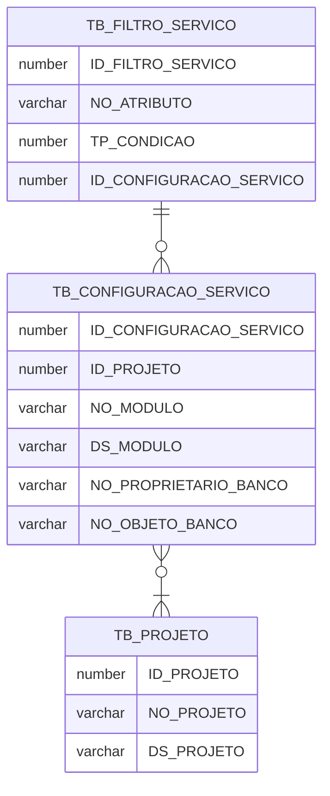

# Projeto Rebeca

O Nome **Rebeca** significa "união", "ligação", "aquela que une" ou "mulher com uma beleza que cativa (ou prende) os homens". O nome Rebeca vem do hebraico Ribhqah, que literalmente significa "união", "ligação", "aquela que une".
O objetivo deste projeto é apresentar os dados de qualquer tabela de um banco de dados Oracle em Json e disponibilizados em formato REST.

# Requisitos para produção
- Oracle com mínimo a versão 12c.
- Ambiente que satisfaça os requisitos para [implementação de um aplicativo utilizando SpringBoot](https://docs.spring.io/spring-boot/docs/current/reference/html/deployment.html). 

# Requisitos para ambiente de desenvolvimento
- Docker

# Arquivos

O projeto está dividido em duas pastas para tratar cada serviço separadamente. Uma para o front-end (rebeca_front) que está desenvolvido em Angular e outra para o back-end (rebeca_server) que está desenvolvido em Java utilizando framework Spring.

# Instalação do ambiente de desenvolvimento

Todo o ambiente foi dockerizado portanto basta executar o comando:

    docker-compose up 

## Serviços disponíveis

### Front-end

### Back-end

- Swagger: http://localhost:8082/swagger-ui.html
- EndPoints:
	- **configuracao-resource**: Configuração que indicará quais tabelas/views/materialized views terão seus dados disponibilizados. Também será informado quais filtros serão obrigatórios e aplicados em cada consulta. 
	- **data-set-resource**:  Apresenta o dado de um objeto que foi configurado para ser apresentado. 
	- **filtro-resource**:  Filtros que serão aplicados nos datasets. Um filtro sempre necessita dos critérios que serão aplicados. Ex: Em um data set que apresenta os Estados brasileiros pode existir um filtro com a Unidade Federativa, portanto essa UF deverá ser informada no endpoint
	- **projeto-resource:** Mantêm os projetos que terão os dados disponibilizados
			

## Banco de dados
Acessos ao SGBD e aos seus serviços de gerenciamento e monitoramento:
- SGBD:  Oracle Standard Edition 12c Release 2

| Tabela | Descrição |
| --- | --- |
| TB_PROJETO | Projeto que disponbilizará dados em formato Rest para o Rebeca. |
| TB_CONFIGURACAO_SERVICO | A Representational State Transfer (REST), em português Transferência de Estado Representacional, é uma abstração da arquitetura da World Wide Web, mais precisamente, é um estilo arquitetural que consiste de um conjunto coordenado de restrições arquiteturais aplicadas a componentes, conectores e elementos de dados dentro de um sistema de hipermídia distribuído.O REST ignora os detalhes da implementação de componente e a sintaxe de protocolo com o objetivo de focar nos papéis dos componentes, nas restrições sobre sua interação com outros componentes e na sua interpretação de elementos de dados significantes.Esta entidade irá auxiliar na configuração do serviço rest e a camada de acesso aos dados, fazendo com que o serviço seja acessado dinamicamente tendo como base a configuração definida pela administração de dados. |
| TB_FILTRO_SERVICO | Cada configuração poderá utilizar mais de uma condição de filtro juntamente com um objecto |
| VW_END_POINT | End points da API gerados a partir das configurações feitas para o projeto. Obs: quando o end point possui um filtro específico ele irá ser apresentado envolto com chaves ({}), porém ao ser usado na API deverá ser informado somente o valor que deseja filtrar. Ex: filtro com ID de número 1 e condição definida como CAMPO = :1 / Como deverá ser passado no endpoint /1/VALORDOCAMPO |

| Tabela | Campo | Descrição |
| --- | --- | --- |
| TB_PROJETO | ID_PROJETO | Identificador gerado automaticamente pelo Oracle. Auxilia na identificação da configuração do serviço REST. |
| TB_PROJETO | NO_PROJETO | Nome único do projeto que irá disponibilizar dados para o Rebeca |
| TB_PROJETO | DS_PROJETO | Breve descrição do projeto. |
| TB_CONFIGURACAO_SERVICO | ID_CONFIGURACAO_SERVICO | Identificador gerado  automaticamente pelo Oracle. Auxilia na identificação da configuração do serviço REST.|
| TB_CONFIGURACAO_SERVICO | ID_PROJETO | Código do projeto |
| TB_CONFIGURACAO_SERVICO | NO_MODULO | Nome do módulo que será passada pela URI do serviço REST (URI - Identificador de Recursos Universal, como diz o próprio nome, é o identificador do recurso. Pode ser uma imagem, uma página, etc, pois tudo o que está disponível na internet precisa de um identificador único para que não seja confundido.) |
| TB_CONFIGURACAO_SERVICO | DS_MODULO | Breve descrição do módulo que está sendo acessado. |
| TB_CONFIGURACAO_SERVICO | NO_OBJETO_BANCO | Nome físico do objeto dentro do banco de dados. |
| TB_CONFIGURACAO_SERVICO | NO_PROPRIETARIO_BANCO | Nome do owner do objeto dentro do banco de dados |
| TB_FILTRO_SERVICO | ID_FILTRO_SERVICO | Identificador gerado automaticamente pelo Oracle. Identificador que auxilia na identificação de um filtro que poderá ser utilizado dentro de uma configuração do serviço REST|
| TB_FILTRO_SERVICO | TP_CONDICAO | Tipo de operacao que podera ser aplicada em um campo especifico do objeto. Valores possiveis: IGUAL(0, "= :1"), DIFERENTE(1, "!= :1"), MAIOR(2, "> :1"),MENOR(3, "< :1"), MAIOROUIGUAL(4, ">= :1"), MENOROUIGUAL(5, "<= :1"), IN(6, "( select * from (TABLE(REBECA.fnc_string_virgula_tabela(:1))))"); Obs: Para operaćões utilizando IN, será utilizado uma funćão que irá quebrar as strings passadas no final do endpoint e transforma-las em uma colećão interável do Oracle. Ex; http://localhost:8080/data-set/all/PROJETO/MODULO/6/35228266,35274100,35442987 <<- Aonde o número 6 é o filtro criado para esse atributo |
| TB_FILTRO_SERVICO | ID_CONFIGURACAO_SERVICO | Identificador gerado automaticamente pela sequence seq_configuracao_servico. Auxilia na identificação da configuração do serviço REST. |
| VW_END_POINT | ID | Identificador gerado automaticamente somente para referência da linha |
| VW_END_POINT | END_POINT | Exemplo de como está sedo gerado um endpoint para disponibilização de dados. Se baseia na união de várias informações das outras tabelas |
| VW_END_POINT | ATRIBUTO_FILTRO | Caso um endpoint possua um filtro em um campo específico, será apresentado a regra correspondente para o símbolo "?" apresentado no campo END_POINT. |
| VW_END_POINT | NO_PROJETO | Nome do projeto que está disponibilizando os dados. |
| VW_END_POINT | NO_MODULO | Nome do módulo deste sistema.|
| VW_END_POINT | DS_MODULO | Breve descrição do módulo de um sistema. |

### Conexão para os usuários sys e system
	- Hostname: localhost
	- Porta: 1521
	- Sid: xe
	- Password: oracle
### Conexão com gerenciador Oracle Application Express web
	- http://localhost:8080/apex
	- workspace: INTERNAL
	- user: ADMIN
	- password: 0Racle$
### Conexão com o console do Oracle Enterprise Manager
	- http://localhost:8080/em
	- user: sys
	- password: oracle
	- connect as sysdba: true